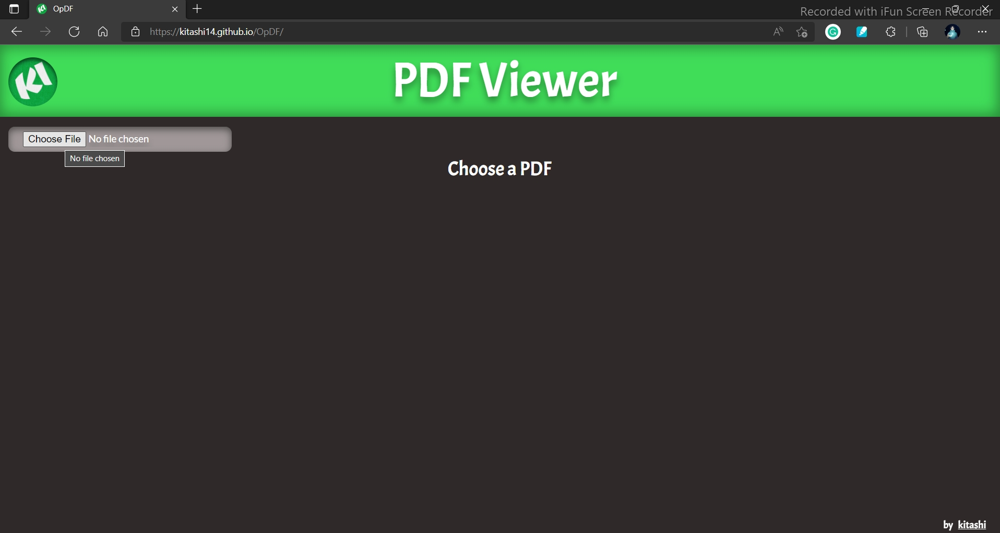
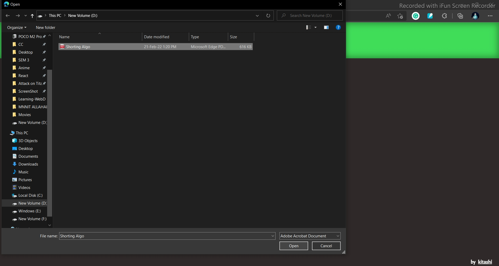
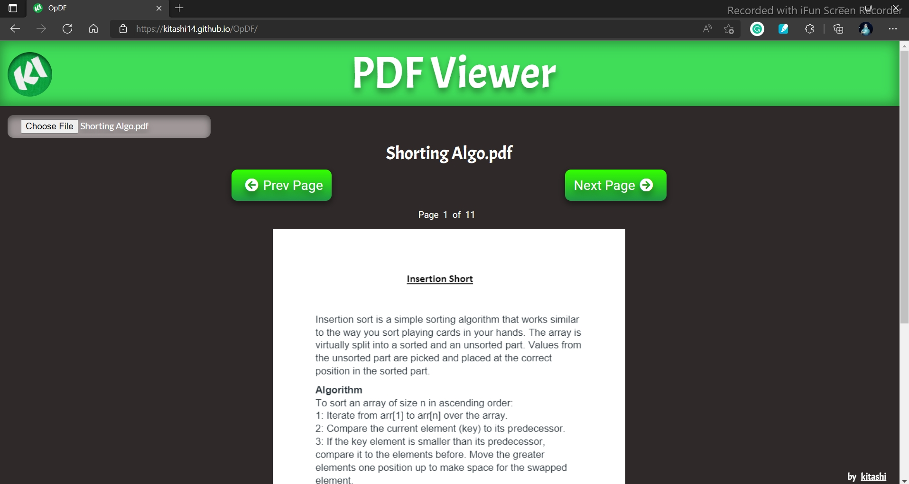
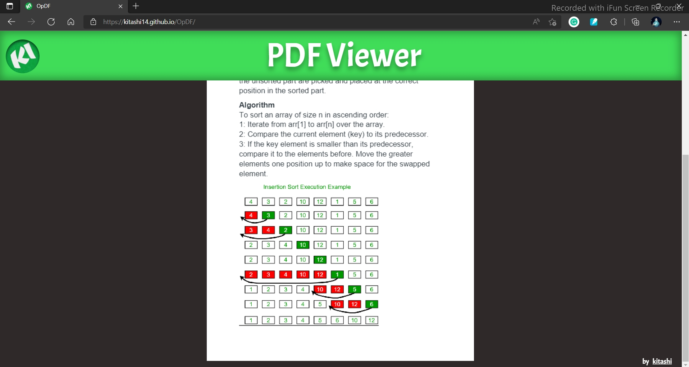

# OpDF 

https://kitashi14.github.io/OpDF/

## Getting Started

A simple web app for viewing different PDF.

## Tech Stack

  1. HTML 
  2. CSS 
  3. JavaScript 

## Screenshots 

  

  
  

  

  
  

  

  
  

  

  
  

